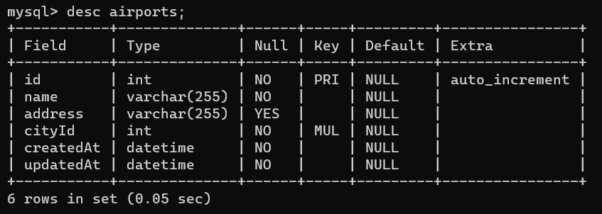

# Welcome to Flights Service

## Some Important folder and their usecases

- ### middlewares
  - All the middlewares will be kept here only
- ### models
  - models are to structure how our table be look like
- ### repository
  - repository role is to interact with the database directly, no one else will interact with DB directly
- ### routes
  - All the routes will be kept here
- ### services
  - Having a sepearte service folder goal is to keep sepearte all the buisness logic
- ### controllers
  - Role of controller is to get the Requests pass it to backend , backend proccess and thus passes res to the frontend
- ### migrations
  - this is for database migration (sequelize)

## Project Setup

- clone the project on your local
- Execute `npm install` on the same path as of your root directory of the downloaded project
- Create a `.env` file in the root directory and add the following environment variable
  - PORT=3000
- Indide the `src/config` folde create a new file `config.json` and add the following piece of json

```
{
  "development": {
    "username": <YOUR_DB_LOGIN_NAME>,
    "password": <YOUR_DB_PASSWORD>,
    "database": "Flights_Search_DB_DEV",
    "host": "127.0.0.1",
    "dialect": "mysql"
  }
}
```

- Once you have added your db config as listed above , go to the src folder from your terminal and execute `npx sequelize db:create`
  and then execute
  `npx sequelize db:migrate`

# DB Design

- Airplane Table
- Flight
- Airport
- City

  ## Brief

- A flight belongs to an airplance but one can be used in muliple flights
- A city has many airports but one airport belogs to a city
- One airport can have many flights , but a flight belongs to one aiport

# DB Design Diagram


# Tables

### City -> id , name , created_at,updated_at

### Airport -> id, name , address, city_id , created_at, deleted_at

Relationship-> city has many airports and Airport belongs to a city (one to many)




